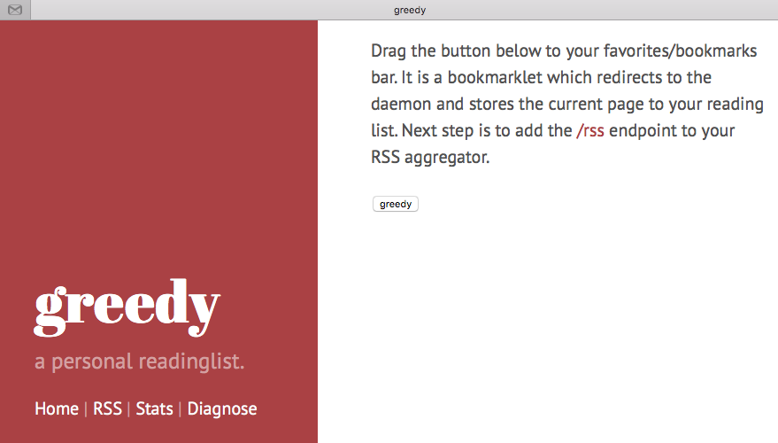

# Greedy
Greedy allows you to run your own collection of `urls to read`. For example: you are reading a webpage and you want to mark it as `read later`, you can use this service to quickly save the page and read it later. From there, the service generates an RSS feed containing all these urls. You can import this RSS feed into your own, favorite RSS client (f.e. [Miniflux](https://miniflux.app/ "Miniflux")).

# Storage
Greedy uses a local database file ([boltdb](https://github.com/boltdb/bolt)) as it's storage. You can specify the location of the database file by setting the `databasefile` environment variable. See environment section below for more information.

# Running in a docker container
`docker run -v /tmp/greedy:/greedy-data -p 9001:8080 --name greedy rogierlommers/greedy`

- Greedy by default runs on port 8080, the above command will bind the container to your (local) port 9001
- It is recommended to mount the database file, so you can create local backups. With the above command, the articles are saved in directory `/tmp/greedy`

###### push new version
First build binary `./build.sh`

- docker build -t rogierlommers/greedy .
- docker push rogierlommers/greedy:latest

###### Usage
Once you have installed and started Greedy, open a browser and point to the `host:port` you have configurated. The greedy homepage should appear. Drag the button to your favorites/bookmarks bar. It is a bookmarklet which redirects to the service and stores the current page to your reading list. Next step is to add the /rss endpoint to your RSS aggregator.

###### Configuration
You can change the default configuration by changing environment vars. For example, running on port 9090 can be done with: `GREEDY_PORT=9090 ./greedy`.

| environment var     | description               | default           |
| --------------------|:-------------------------:| ------------------|
| GREEDY_HOST         | host it binds to          | 0.0.0.0           |
| GREEDY_PORT         | http port                 | 8080              |
| GREEDY_DATABASEFILE | location of database file | ./articles.bolt   |

###### Need help?
For more information, please don't hesitate to contact me [@rogierlommers](https://twitter.com/rogierlommers).

# History
- uses BOLT as storage engine
- display articles as RSS
- scrapes title and page description
- single binary containing all (static) files, easy to install
- multiple platforms: linux and darwin

# Screenshots

